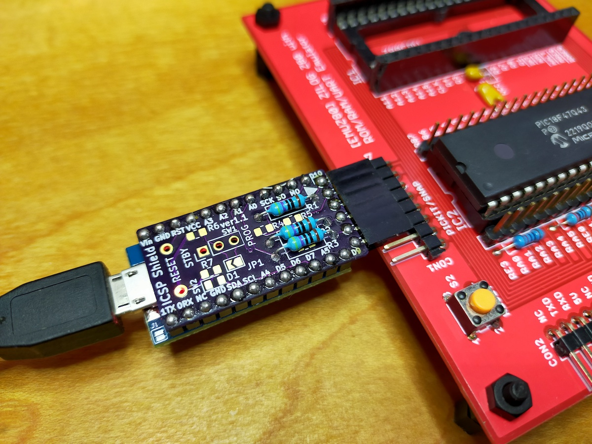
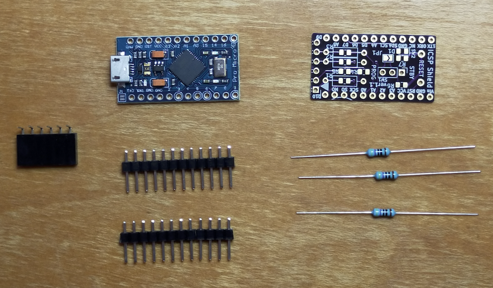

# Pro Micro ICSP shield

This tiny board is based on "A170421" for Arduino UNO which you can find on
<a href="https://www.pcbway.com/project/shareproject/68k_MBC__a_3_ICs_68008_homebrew_computer.html">
a 3 ICs 68008 homebrew computer</a> page.
The board is rearranged for Arduino pro micro instead of UNO.

You can program PIC 18F47Q43, 18F47Q43 and so on with the programmer.
Please see the supported device list on the 
<a href="https://github.com/hanyazou/a-p-prog">a-p-prog</a>page.

## Appearance
The purple board in the following photo is Pro Micro ICSP and the red board is PIC 18F43Q47 EMUZ80.

## Components you need

  * 1 Pro Micro (Arduino compatible, ATMEGA 32u4, 5V)  
    5V version is required for 5V PIC MCUs.
  * 3 Resistors 470 ohms 1/4W  
    0805 SMD resistors can be used.
  * 1 Pin socket (0.1" pitch 6x1 pin, right angle)
  * 2 Pin sockets (0.1" pitch 12x1 pin)

## Build Instructions

### Step 1: resisters
Solder R1, R2 and R3 to the board.
You can ignore all other registers R4 to R7.

### Step 2: pin socket
Solder the 6x1 pin socket to the board.

### Step 3: pin headers
Assemble the pro micro board, pin headers and the board.
At this time, solder VCC, GND, A0, A1 and A3 only.
And should not solder other pins.
It might be difficult to recover from any problems, if all are soldered.

### Step 4: check the operarion
At this time, you must check the programmer.

Please refer the firmware and programmer command project.  
https://github.com/hanyazou/a-p-prog

### Step 5: finish
If you are sure the programmer works perfectory to write your own firmware to a PIC MCU,
you can solder other pins to make it robust.

## Links

### Arduino firmware and writer program for Pro Micro
https://github.com/hanyazou/a-p-prog

### OSHPARK
The gerber file is also shared on the OSHPARK and can be ordered on the site.
https://oshpark.com/shared_projects/9rvbAEvc

### 68k-MBC: a 3 ICs 68008 homebrew computer
https://www.pcbway.com/project/shareproject/68k_MBC__a_3_ICs_68008_homebrew_computer.html
